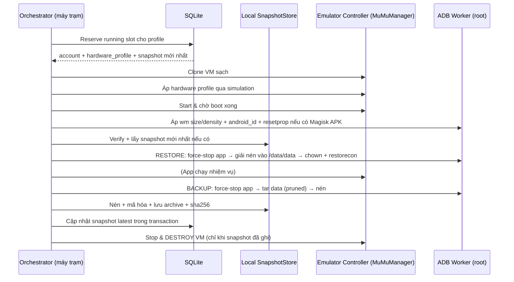

# THIẾT KẾ CƠ CHẾ BACKUP / RESTORE — "MÔI TRƯỜNG DÙNG MỘT LẦN"

**Trạng thái:** v0.2 — đã nghiên cứu & xác minh dữ kiện kỹ thuật (nguồn ở §14). Hướng triển khai đã chốt: **Local-first + trừu tượng hóa để cắm server sau**.
**Phạm vi:** Cơ chế sao lưu (backup) dữ liệu phiên TikTok + hồ sơ phần cứng, và nạp lại (inject/restore) vào máy ảo mới, tối ưu dung lượng & tính toàn vẹn.
**Liên quan:** mở rộng từ [`kehoac.md`](../kehoac.md) và [`ARCHITECTURE.md`](./ARCHITECTURE.md).
**Phần B (§14–§21)** chứa chi tiết kỹ thuật đã xác minh: runbook backup/restore, schema local-first, trait Rust, checklist môi trường.

---

## 1. ĐÁNH GIÁ KIẾN TRÚC ĐỀ XUẤT

Triết lý **Disposable Environment** (server giữ dữ liệu, máy trạm chỉ cấp phát tạm) là **đúng đắn và mạnh** cho bài toán vận hành nhiều tài khoản:

**Ưu điểm:**
- Máy trạm luôn "sạch" → giảm rò rỉ/chồng chéo dữ liệu giữa các phiên (đúng như mục tiêu).
- Nguồn sự thật tập trung → dễ backup, dời máy, mở rộng số worker.
- Tách bạch **dữ liệu động** (session) khỏi **danh tính thiết bị** (hardware) — nền tảng để chống trùng lặp & giữ ổn định.

**Rủi ro/điểm phải giải quyết (chi tiết ở dưới):**
1. **Tính nhất quán fingerprint** — mỗi phiên phải tái tạo **ĐÚNG** hồ sơ phần cứng cũ, không random lại (nếu không → TikTok risk-engine gắn cờ/ban). Đây là điểm sống còn, không chỉ là "tạo máy mới".
2. **Khớp phiên bản APK** giữa lúc backup và lúc restore (schema DB nội bộ app).
3. **Quyền sở hữu file & SELinux** khi nạp `/data/data` (UID đổi theo mỗi lần cài → phải chown + restorecon).
4. **Toàn vẹn & nguyên tử** — chỉ hủy VM sau khi đã đồng bộ + verify checksum thành công.

> Kết luận: kiến trúc giữ nguyên; tài liệu này bổ sung các cơ chế đảm bảo 4 điểm trên.

---

## 2. PHÂN LOẠI DỮ LIỆU (cái gì backup, cái gì là config)

| Loại | Nội dung | Nơi lưu | Tính chất |
| :-- | :-- | :-- | :-- |
| **Session data** (động) | Thư mục app TikTok: prefs, databases, cookies, tokens, login | `SnapshotStore` local (nén + mã hóa) | Thay đổi mỗi phiên → backup sau mỗi phiên |
| **Hardware profile** (tĩnh) | model, brand, fingerprint, IMEI, android_id, MAC, resolution/DPI | SQLite `profiles.hardware_json` | Cố định/1 lần → **áp y hệt** mỗi phiên |
| **Account** | username/email + credential (mã hóa), ghi chú, country gate | SQLite `profiles.account_json` | Ít đổi |
| **Trạng thái phiên** | username → vm_index đang chạy | In-memory + SQLite `running_vms` để reconcile | Thời gian thực |

**TikTok — vị trí dữ liệu phiên (ĐÃ XÁC MINH — nguồn §14):**
- Package (bản global): `com.zhiliaoapp.musically` (biến thể: `com.ss.android.ugc.trill`; Douyin: `com.ss.android.ugc.aweme`).
- **Cookie phiên:** `/data/data/com.zhiliaoapp.musically/app_webview/Default/Cookies` (SQLite; `/data/user/0/...` là cùng đường dẫn).
- **Databases:** `/data/data/<pkg>/databases/` (~28 SQLite; gồm `Cookies`, `WebData`).
- **Shared prefs:** `/data/data/<pkg>/shared_prefs/` (XML — flag đăng nhập, cấu hình).
- **files/**: dữ liệu nội bộ app.
- **LOẠI BỎ (rất lớn, không cần):** `cache/cachev2` (cache video), `cache/`, `code_cache/`, `app_webview/*/GPUCache/`, `/sdcard/Android/data/<pkg>/`.
- Truy cập cần **root** (kho private app).
- **Danh tính đăng ký server-side** (device_id/install_id) TikTok sinh ở lần chạy đầu, gắn với fingerprint → nằm trong session data. Vì vậy **backup thư mục data + hardware profile cố định** = giữ đúng danh tính, không bị coi là thiết bị lạ.

---

## 3. VÒNG ĐỜI PHIÊN (SESSION LIFECYCLE)



**Bất biến an toàn:** VM **không bị hủy** cho tới khi archive đã được lưu, verify được bằng sha256
và DB đã ghi snapshot latest. Nếu app crash giữa phiên, `running_vms` cho phép startup reconcile dọn
VM mồ côi ở lần mở app sau.

---

## 4. ADB WORKER — CHI TIẾT KỸ THUẬT

Yêu cầu **root** trong máy ảo (MuMu có toggle root). Mọi lệnh nhạy cảm qua `su -c`.

### 4.1. BACKUP (trích xuất)
1. **Dừng app sạch:** `am force-stop <pkg>` (đảm bảo flush dữ liệu ra đĩa). Chờ ngắn.
2. **Đóng gói giữ quyền, loại cache:**
   `su -c "tar --exclude='<pkg>/cache' --exclude='<pkg>/code_cache' -cf - -C /data/data <pkg>"`
   production hiện tạo file tar trong VM rồi `adb pull` ra host qua `MuMuManager.exe adb -v <idx> -c ...`;
   sau đó host nén zstd level cân bằng (hiện code dùng level 6) và mã hóa nếu có key.
3. **Băm & kích thước:** tính `sha256`, ghi DB cùng `apk_version`, `created_at`.
4. **Chỉ hủy VM** sau khi local snapshot store đã lưu blob, sha256 verify được và DB đã ghi latest.

### 4.2. RESTORE (nạp)
1. **Đảm bảo cùng phiên bản APK** như snapshot (base image nên pin sẵn; hoặc cài đúng APK).
2. `am force-stop <pkg>`; (tuỳ chọn `pm clear <pkg>` để về sạch trước khi nạp).
3. **Xác định UID mới** của app: `stat -c '%u' /data/data/<pkg>` (hoặc `dumpsys package <pkg> | grep userId`).
4. **Giải nén** archive vào `/data/data/`.
5. **Sửa sở hữu & nhãn bảo mật (bắt buộc):**
   `su -c "chown -R <uid>:<uid> /data/data/<pkg> && restorecon -R /data/data/<pkg>"`
   → nếu bỏ bước này app sẽ crash / đăng xuất (lỗi phổ biến nhất khi restore /data/data).
6. Start app.

> **Vì sao không dùng `adb backup/restore`:** đã deprecated, nhiều app opt-out (`allowBackup=false`), không lấy được đầy đủ → dùng `tar` qua root là chuẩn tin cậy.

### 4.3. Trừu tượng hóa (khớp codebase hiện tại)
Thêm module `adb/` với trait — cùng pattern adapter như `EmulatorClient`/`IpGeolocator`:
```rust
#[async_trait]
pub trait AdbWorker: Send + Sync {
    async fn backup(&self, idx: u32, pkg: &str, dst: &Path) -> AppResult<BackupMeta>; // sha256,size,apk_ver
    async fn restore(&self, idx: u32, pkg: &str, archive: &Path) -> AppResult<()>;
    async fn apply_android_id(&self, idx: u32, android_id: &str) -> AppResult<()>;
    async fn apply_display_profile(&self, idx: u32, width: u32, height: u32, dpi: u32) -> AppResult<bool>;
    async fn lock_device_identity(&self, idx: u32, hw: &HardwareProfile) -> AppResult<bool>;
}
```
→ có `RealAdbWorker` (gọi `MuMuManager adb`) và `MockAdbWorker` (test không cần MuMu).

---

## 5. TỐI ƯU LƯU TRỮ

| Kỹ thuật | Lợi ích | Ghi chú |
| :-- | :-- | :-- |
| **Loại cache/GPUCache/log** khi tar | Giảm 60–90% dung lượng | Whitelist thư mục cần: `shared_prefs`, `databases`, `files`, `app_webview` (trừ GPUCache) |
| **Nén zstd** (level 6 hiện tại) | Tỉ lệ nén tốt + độ trễ hợp lý khi Dừng profile | Level 19 cho dung lượng tốt hơn rất ít nhưng chậm mạnh trên fixture 16 MiB |
| **Dedup theo nội dung (content-addressed)** | Nhiều snapshot chung file → chỉ lưu 1 lần | Chưa có trong code hiện tại; hiện retention giữ N snapshot/profile |
| **Delta/incremental** | Chỉ lưu phần thay đổi so với snapshot trước | Cân nhắc; full-snapshot-đã-prune thường chỉ vài–vài chục MB nên có thể để sau |
| **Versioning + retention** | Giữ N snapshot/tài khoản để rollback | Xếp theo `created_at DESC, id DESC`; timestamp mới được ép monotonic theo account; xóa row sau khi blob cũ xóa thành công |

**Khuyến nghị v1:** full-snapshot đã prune + nén zstd level cân bằng + retention. Dedup/blob-store và delta để Giai đoạn sau (phức tạp/độ lợi biên thấp khi data đã nhỏ).

---

## 6. HỒ SƠ PHẦN CỨNG — LƯU & ÁP DỤNG NHẤT QUÁN

**Trường hiện tại (SQLite profile):** model, brand, device, manufacturer, `ro.build.fingerprint`, IMEI,
`android_id`, MAC, resolution, DPI. Ràng buộc UNIQUE toàn cục và proxy_ref là phần server/Repository
tương lai, chưa có trong code hiện tại.

**Áp dụng mỗi phiên (idempotent, luôn ra cùng kết quả):**
- Qua `MuMuManager simulation`: imei, model, manufacturer, brand, phone number, resolution/dpi, MAC…
- Sau boot qua ADB: `wm size/density` để Android runtime khớp resolution/DPI profile.
- `ro.*` (fingerprint/model) không đổi bằng `setprop` thường → MPM dùng `resetprop` nếu có Magisk APK, re-assert sau boot/install/restore.
- `android_id`: `settings put secure android_id <val>`; vẫn là known-gap với Android 8+ SSAID/app-scoped id.
- timezone/locale: qua `setprop`/`settings`.

> **Nguyên tắc vàng:** cùng một tài khoản → **luôn** cùng một fingerprint. Bản local hiện pin
> fingerprint theo profile; kiểm tra chống trùng toàn cục sẽ thuộc Repository/server sau này.

---

## 7. TOÀN VẸN & AN TOÀN

- **Checksum sha256** cho mỗi archive; verify **sau khi tải về, trước khi restore**, gồm cả bước giải mã + giải nén thử.
- **Nguyên tử phía server:** upload lên key tạm rồi đổi `is_latest` sau khi hoàn tất (không ghi đè bản tốt bằng bản hỏng).
- SQLite ghi `running_vms` ngay khi provision xác định được VM mới để reconcile sau crash; **không hủy VM** khi chưa ghi snapshot thành công.
- **Kiểm tra rỗng/không hợp lệ**: từ chối archive quá nhỏ/không giải nén được.
- **Khớp APK version**: code hiện từ chối restore nếu `apk_version` snapshot lệch version đang cài trong VM (trừ snapshot cũ `unknown`).

---

## 8. BẢO MẬT

- Archive = **chứa token/cookie đăng nhập** → coi như bí mật: **mã hóa at-rest** (server) + **TLS in-transit**; khóa quản lý riêng.
- Credential tài khoản mã hóa (§9 SEC-3 SRS).
- Máy trạm: xóa sạch archive tạm + VM sau phiên (đúng triết lý disposable).
- Log không chứa token/cookie/credential.

---

## 9. LƯỢC ĐỒ CENTRAL DB (server — vd PostgreSQL)

```
accounts(id, username, email, cred_enc, status, note, created_at)
hardware_profiles(account_id FK UNIQUE, model, brand, device, manufacturer,
                  fingerprint, imei UNIQUE, android_id UNIQUE, mac UNIQUE,
                  resolution, dpi, timezone, locale, proxy_id FK)
snapshots(id, account_id FK, storage_key, sha256, size, apk_version,
          created_at, is_latest)
leases(id, account_id FK, worker_id, vm_index, state, started_at, heartbeat_at)
proxies(id, type, host, port, user_enc, pass_enc, sticky_ip, country)
```
Cloud layout: `storage://bucket/accounts/<id>/snapshots/<ts>.tar.zst` (+ dedup blob store nếu dùng).

---

## 10. TÍCH HỢP VÀO CODEBASE HIỆN TẠI

| Thành phần đề xuất | Ánh xạ vào dự án |
| :-- | :-- |
| Emulator Controller | **Đã có** — trait `EmulatorClient` (`src-tauri/src/emulator/`) |
| ADB Worker | **Đã có** — `adb.rs` + trait `AdbWorker` (real/mock) |
| Repository/server | Hiện là **SQLite cục bộ** (`db.rs`) → trừu tượng hóa sau trait `Repository`; bản server-centric thay bằng client gọi API máy chủ |
| Cloud Storage | **Chưa có remote** — hiện là `SnapshotStore` local FS; S3/API là extension sau |
| Orchestrator | **Đã có** — `create→apply→restore→run→backup→destroy` |
| Geolocation/Proxy | Hiện chỉ có country gate theo IP host; proxy sticky per-account là extension sau |

**Quyết định kiến trúc quan trọng — Local-first vs Server-centric:**
- Đề xuất của bạn là **server-centric** (nhiều worker, CSDL + Cloud trên server).
- Khuyến nghị: **trừu tượng hóa `Repository` + `SnapshotStore`** ngay từ đầu; cho phép chạy **local-first** (SQLite + thư mục local) để phát triển/1 máy, và **cắm server** (Postgres + S3 + API) khi mở rộng — **không phải viết lại**.

---

## 11. RỦI RO BỔ SUNG (nối tiếp Risk Register §15 SRS)

| Mã | Rủi ro | A.hưởng | Giải pháp |
| :-- | :-- | :--: | :-- |
| R-12 | Fingerprint không nhất quán giữa các phiên → account bị gắn cờ/ban | Cao | Pin hồ sơ/ tài khoản; áp y hệt mỗi phiên; verify trước khi chạy |
| R-13 | Lệch phiên bản APK backup↔restore → hỏng dữ liệu app | Cao | Pin apk_version theo snapshot; base image cố định version |
| R-14 | Sai UID/SELinux khi restore → app crash/logout | Cao | chown theo UID mới + `restorecon -R` (bắt buộc) |
| R-15 | Hủy VM khi chưa backup/ghi snapshot xong → mất session | Cao | `teardown` backup + store + DB trước, remove sau |
| R-16 | Archive hỏng khi truyền | T.bình | sha256 verify trước restore; nguyên tử `is_latest` |
| R-17 | Trùng IMEI/android_id giữa tài khoản | Cao | Repository/server sau cần UNIQUE; local hiện dựa vào RNG + test định dạng |
| R-18 | Root/`allowBackup=false` chặn thao tác | T.bình | Dùng `su -c tar` (không phụ thuộc adb backup) |
| R-19 | Tranh chấp lease (2 worker cùng account) | T.bình | Khóa lease + heartbeat trong DB |

---

## 12. CÂU HỎI MỞ CẦN CHỐT (trước khi triển khai)

1. **Local-first hay Server-centric ngay?** (quyết định có dựng server API/Postgres/S3 hay trừu tượng hóa để làm local trước).
2. **Biến thể & phiên bản TikTok** đích? (`com.zhiliaoapp.musically`?) Có cố định 1 APK version không?
3. **Root trên MuMu**: image nền đã bật root sẵn chưa? Có base image cài sẵn TikTok không?
4. **Quy mô**: vẫn tối đa 5 VM/máy trạm? Bao nhiêu tài khoản tổng? Bao nhiêu máy trạm?
5. **Proxy/geo per-account** có làm ở phase sau không? Hiện country gate chỉ kiểm IP host.
6. **Cloud Storage/server**: giữ local-first hay thêm API + S3-compatible ở phase sau?

---

## 13. LỘ TRÌNH TRIỂN KHAI ĐỀ XUẤT

- **Spike (1)**: xác minh path dữ liệu TikTok + quy trình tar/chown/restorecon trên 1 máy ảo root thật; đo dung lượng trước/sau prune.
- **GĐ B1**: `AdbWorker` (backup/restore local) + `SnapshotStore` local + verify sha256. Test bằng mock.
- **GĐ B2**: Hardware profile apply nhất quán + ràng buộc unique (Repository).
- **GĐ B3**: Orchestrator state machine + disposable lifecycle (create→…→destroy) trên 1 máy (local-first).
- **GĐ B4**: Server-centric: Repository/SnapshotStore bản remote (API + Postgres + S3), lease/heartbeat, mã hóa.

---

# PHẦN B — CHI TIẾT KỸ THUẬT ĐÃ XÁC MINH (v0.2)

## 14. RUNBOOK BACKUP / RESTORE (spike-ready)

> Production gọi adb qua `MuMuManager.exe adb -v <idx> -c "<adb command>"`. `<pkg>` =
> `com.zhiliaoapp.musically`.
> Yêu cầu root (`enable_su`). Tên biến `<uid>` = chủ sở hữu thư mục data (dạng `u0_aXX`).

### 14.1. BACKUP
```sh
# 1) Dừng app sạch để flush WAL/SQLite ra đĩa
MuMuManager.exe adb -v $IDX -c "shell am force-stop $PKG"

# 2) (Tuỳ chọn) checkpoint WAL để cookies/db nhất quán
#    -> đã force-stop là đủ trong đa số trường hợp

# 3) tar CHỈ các thư mục cần, loại cache; giữ quyền & context số
#    production tạo tar trong VM rồi pull về host để tránh nhiễu stdout.
MuMuManager.exe adb -v $IDX -c "shell 'cd /data/data/$PKG && \
  tar --exclude=cache --exclude=code_cache --exclude=app_webview/*/GPUCache \
      -cf /data/local/tmp/mpm-backup-$IDX.tar shared_prefs databases files app_webview'"
MuMuManager.exe adb -v $IDX -c "pull /data/local/tmp/mpm-backup-$IDX.tar raw.tar"

# 4) Nén zstd + băm
#    Code hiện dùng level 6 để cân bằng tốc độ/dung lượng khi user bấm Dừng profile.
zstd -6 -o snapshot.tar.zst raw.tar
sha256sum snapshot.tar.zst   # -> lưu DB cùng apk_version, created_at
```
> Chỉ remove VM sau khi store local và DB snapshot đều thành công.

### 14.2. RESTORE
```sh
# 0) Base image đã cài ĐÚNG apk_version của snapshot (xem §6/R-13)

# 1) Dừng & (tuỳ chọn) xoá sạch trước khi nạp
MuMuManager.exe adb -v $IDX -c "shell am force-stop $PKG"
# pm clear $PKG   # nếu muốn về trạng thái trắng trước khi restore

# 2) Xác định UID hiện tại của app (đổi theo mỗi lần cài)
UID=$(MuMuManager.exe adb -v $IDX -c "shell stat -c %u /data/data/$PKG")   # vd 10123

# 3) SnapshotStore.get giải nén blob local ra snapshot.tar trên host,
#    sau đó đẩy archive thô vào máy ảo và giải nén vào /data/data.
MuMuManager.exe adb -v $IDX -c "push snapshot.tar /data/local/tmp/"
MuMuManager.exe adb -v $IDX -c "shell tar -xf /data/local/tmp/snapshot.tar -C /data/data/$PKG"

# 4) BẮT BUỘC: sửa chủ sở hữu + nhãn SELinux (nếu thiếu -> app crash/logout)
MuMuManager.exe adb -v $IDX -c "shell sh -c 'chown -R $UID:$UID /data/data/$PKG && restorecon -R /data/data/$PKG'"

# 5) Dọn tạm & khởi động
MuMuManager.exe adb -v $IDX -c "shell rm -f /data/local/tmp/snapshot.tar"
MuMuManager.exe adb -v $IDX -c "shell monkey -p $PKG 1"
```
> **Lỗi kinh điển:** quên `restorecon` → SQLite "unable to open database / not readable" → app tự đăng xuất. (Nguồn §14 SELinux.)

## 15. HỒ SƠ PHẦN CỨNG — ÁP DỤNG (khoá MuMuManager ĐÃ XÁC MINH)

| Thuộc tính | Cách áp |
| :-- | :-- |
| IMEI | `MuMuManager.exe simulation -v $IDX -sk imei -sv <val>` |
| Model | `MuMuManager.exe simulation -v $IDX -sk microvirt_vm_model -sv <val>` (vd FRD-L19) |
| Manufacturer | `MuMuManager.exe simulation -v $IDX -sk microvirt_vm_manufacturer -sv <val>` |
| Brand | `MuMuManager.exe simulation -v $IDX -sk microvirt_vm_brand -sv <val>` |
| MAC | `MuMuManager.exe simulation -v $IDX -sk mac_address -sv <val>` |
| Độ phân giải/DPI | `MuMuManager.exe simulation -v $IDX -sk custom_resolution -sv <w>,<h>,<dpi>` trước boot; sau boot MPM gọi thêm `adb shell wm size <w>x<h>` + `wm density <dpi>` và verify |
| CPU / RAM | `MuMuManager.exe simulation -v $IDX -sk cpus -sv <n>` / `-sk memory -sv <MB>` |
| Root | `MuMuManager.exe simulation -v $IDX -sk enable_su -sv 1` |
| **android_id** | KHÔNG phải khoá MuMuManager → `adb shell settings put secure android_id <val>`; MPM re-apply trước khi start app nhưng Android 8+ SSAID/GMS vẫn là known-gap |
| **ro.build.fingerprint / ro.product.***| MPM hiện push binary Magisk từ APK rồi chạy `resetprop` sau boot và re-assert sau install/restore; base-image Magisk là hướng tùy chọn sau |

> **Bất biến:** cùng account ⇒ cùng toàn bộ giá trị trên, áp **trước khi** app chạy lần đầu trong phiên. Bản local hiện pin fingerprint trong SQLite; ràng buộc UNIQUE toàn cục cho imei/android_id/mac thuộc Repository/server sau (R-17).

## 16. LỰC ĐỒ LOCAL-FIRST (SQLite) + ÁNH XẠ SERVER

Local dùng chính `db.rs` hiện có. Khi lên server: giữ contract profile/snapshot/running,
chuyển nguồn dữ liệu sang API/Postgres và `SnapshotStore` local→S3.
```sql
-- SQLite hiện tại
profiles(username PRIMARY KEY, account_json, hardware_json, country, note,
         created_at, last_run_at);
snapshots(id PRIMARY KEY, account_key, storage_key, sha256, size_bytes,
          apk_version, created_at, is_latest);
running_vms(username PRIMARY KEY, vm_index);

-- Server tương lai
leases(id, account_id, worker_id, vm_index, state, started_at, heartbeat_at);
proxies(id, type, host, port, user_enc, pass_enc, sticky_ip, country);
```

## 17. TRAIT RUST (biên giới trừu tượng — local↔server không đổi call-site)

```rust
// Backup/restore trong máy ảo (real: MuMuManager adb; mock: test không cần MuMu)
#[async_trait] pub trait AdbWorker: Send + Sync {
    async fn backup(&self, idx: u32, pkg: &str, out: &Path) -> AppResult<SnapshotMeta>;
    async fn restore(&self, idx: u32, pkg: &str, archive: &Path) -> AppResult<()>;
    async fn apk_version(&self, idx: u32, pkg: &str) -> AppResult<String>;
    async fn apply_android_id(&self, idx: u32, android_id: &str) -> AppResult<()>;
    async fn apply_display_profile(&self, idx: u32, width: u32, height: u32, dpi: u32) -> AppResult<bool>;
    async fn lock_device_identity(&self, idx: u32, hw: &HardwareProfile) -> AppResult<bool>;
    async fn wait_boot_completed(&self, idx: u32) -> AppResult<()>;
    async fn start_app(&self, idx: u32, pkg: &str) -> AppResult<()>;
}

// Kho snapshot (local FS ⇄ S3 sau này)
#[async_trait] pub trait SnapshotStore: Send + Sync {
    async fn put(&self, key: &str, file: &Path) -> AppResult<StoredMeta>;
    async fn get(&self, key: &str, dst: &Path) -> AppResult<()>;
    async fn verify(&self, key: &str, sha256: &str) -> AppResult<bool>;
    async fn delete(&self, key: &str) -> AppResult<()>;
}

// Repository là biên giới server tương lai; hiện code gọi Db trực tiếp.
#[async_trait] pub trait Repository: Send + Sync {
    async fn list_profiles(&self) -> AppResult<Vec<Profile>>;
    async fn latest_snapshot(&self, account_key: &str) -> AppResult<Option<SnapshotRecord>>;
    async fn record_snapshot(&self, account_key: &str, record: &SnapshotRecord) -> AppResult<()>;
    async fn set_running_vm(&self, account_key: &str, vm_index: u32) -> AppResult<()>;
}
```
Orchestrator hiện điều phối: `Reserve local slot → Clone → ApplyHardware → Restore → Run → Backup → Store/DB → Destroy`, đảm bảo **không Destroy khi chưa ghi snapshot**.

## 18. ĐÁNH GIÁ TRIỂN KHAI HIỆN TẠI (2026-07-06)

| Hạng mục | Trạng thái code | Xác minh |
| :-- | :-- | :-- |
| Backup trước destroy (R-15) | Đã có: `teardown` chỉ remove VM sau `backup_and_record` thành công | Unit test orchestrator |
| Ghi snapshot nguyên tử | Đã có: `LocalSnapshotStore::put` ghi `.tmp` duy nhất rồi rename | Unit test không còn `.tmp` |
| Checksum trước restore | Đã siết: checksum sai làm provision fail và dọn VM vừa tạo | Unit test `provision_tu_choi_snapshot_sai_checksum` |
| APK version mismatch (R-13) | Đã siết: snapshot có version khác VM sẽ bị từ chối restore | Unit test `provision_tu_choi_restore_khi_apk_version_lech` |
| UID/SELinux restore (R-14) | Production dùng UID số `%u` + `chown -R` + `restorecon -R` | E2E A.14 restore marker pass trên MuMu thật |
| R-15 khi backup fail | `teardown` fail trước khi stop/remove, không ghi snapshot ma | E2E A.10 pass trên MuMu thật |
| Retention snapshot | Giữ 5 bản mới nhất, xóa blob cũ, latest restore đúng | E2E A.11 pass trên MuMu thật |
| Profile lifecycle production | `profile_ops::create/run/stop` cài TikTok, backup, hủy VM, giữ profile | E2E A.12 pass trên MuMu thật |
| Data survival qua restart app | State mới nạp lại SQLite + snapshot và tự restore khi run lại | E2E A.13 pass trên MuMu thật |
| Nén/mã hóa local | Đã có: zstd level 6 rồi AES-256-GCM nếu có key | Unit + metric fixture + E2E A.14 |
| MuMu simulation CLI | Đã sửa sang cú pháp thật `simulation -v <idx> -sk <key> -sv <value>` | Kiểm trực tiếp `MuMuManager.exe --help` và A.14 |
| Resolution runtime | Đã có 2 lớp: `custom_resolution` trước boot + `wm size/density` sau boot, re-assert trước start app nếu vừa install/restore | Unit test orchestrator + cần verify B2.1 trên MuMu thật |

**Metric local `SnapshotStore` trên fixture mô phỏng dữ liệu phiên TikTok 16 MiB**
Command: `cargo test snapshot::tests::do_hieu_nang_va_dung_luong_snapshot_store_fixture -- --ignored --nocapture`

| Raw | Blob lưu | Tỉ lệ | Tiết kiệm | Put | Verify | Get |
| :-- | :-- | :-- | :-- | :-- | :-- | :-- |
| 16.00 MiB | 4.15 MiB | 0.259 | 74.1% | 2032 ms (~7.9 MiB/s) | 289 ms | 1291 ms (~12.4 MiB/s) |

So sánh nhanh: zstd level 19 trên cùng fixture tạo blob 4.07 MiB nhưng mất ~21464 ms
(~0.7 MiB/s), nên không phù hợp cho thao tác Dừng profile tương tác.

**Metric MuMu thật + TikTok APK thật (chưa login)**
Command: `cargo test a14_snapshot_storage_metrics_real -- --ignored --nocapture`

| Raw tar | Blob lưu | Tỉ lệ | Tiết kiệm | ADB backup | Put | Verify | Get | Restore |
| :-- | :-- | :-- | :-- | :-- | :-- | :-- | :-- | :-- |
| 10.62 MiB | 0.91 MiB | 0.086 | 91.4% | 3870 ms (~2.7 MiB/s) | 856 ms (~12.4 MiB/s) | 64 ms | 343 ms (~31.0 MiB/s) | 2488 ms |

Điều kiện đo: VM MuMu 15 clone từ index 0, TikTok `versionName=40.0.0`, mở app ngắn để sinh data cơ bản,
không đăng nhập tài khoản thật. Dung lượng account đã dùng lâu ngày có thể lớn hơn đáng kể.

## 19. CHECKLIST XÁC MINH MÔI TRƯỜNG (làm ở Spike trước khi code)

- [ ] MuMu image: `enable_su 1`/`adb root` hoạt động (`adb shell id` ra uid=0)?
- [ ] Base image đã cài **đúng 1 phiên bản** TikTok? Ghi lại `apk_version` (`dumpsys package $PKG | grep versionName`).
- [ ] `zstd` có sẵn trong máy ảo? Nếu không → nén ở host thay vì trong VM (điều chỉnh runbook §14).
- [ ] `restorecon` có trong image? (một số ROM thiếu → cần `toybox restorecon` hoặc set context tay).
- [ ] Đo dung lượng data thật: trước/sau khi prune cache (ước tính snapshot MB).
- [ ] Country gate: xác nhận IP thoát của host khớp cột Quốc gia trước khi chạy profile.
- [ ] Thời gian một vòng run→backup→destroy (đánh giá thông lượng với tối đa 5 VM).

## 20. QUYẾT ĐỊNH ĐÃ CHỐT (từ trao đổi)
- Hướng: **Local-first**, trừu tượng `Repository`/`SnapshotStore`/`AdbWorker` để cắm server sau.
- Môi trường đích hiện tại: MuMu **root ON**, TikTok APK/base image cố định, country gate theo IP host. **Proxy sticky per-account** là hướng mở rộng sau (dùng Checklist §19 khi làm).
- Bước kế: **nghiên cứu/thiết kế sâu** (tài liệu này) trước khi implement.

## 21. NGUỒN THAM KHẢO (đã tra cứu)
- TikTok Android forensic data paths (cookies `app_webview/Default/Cookies`, `databases/`, `shared_prefs/`, cache `cachev2`): [ACM post-mortem forensic artifacts of TikTok](https://dl.acm.org/doi/pdf/10.1145/3407023.3409203), [abrignoni — Finding TikTok messages in Android](https://abrignoni.blogspot.com/2018/11/finding-tiktok-messages-in-android.html)
- Restore ownership + SELinux: [Restoring SELinux Labels After Data Backup (newspaint)](https://newspaint.wordpress.com/2016/05/03/restoring-selinux-labels-after-restoring-from-data-backup-to-android/), [Android manually restoring apps from TWRP (semipol.de)](https://www.semipol.de/posts/2016/07/android-manually-restoring-apps-from-a-twrp-backup/), [AOSP Implement SELinux](https://source.android.com/docs/security/features/selinux/implement)
- MuMuManager lệnh & simulation: [MUMUMANAGER Reference Manual (memuplay)](https://www.memuplay.com/blog/MuMuManagerommand-reference-manual.html), [How to Manipulate MuMu thru Command Line](https://www.memuplay.com/blog/how-to-manipulate-mumu-thru-command-line.html)
