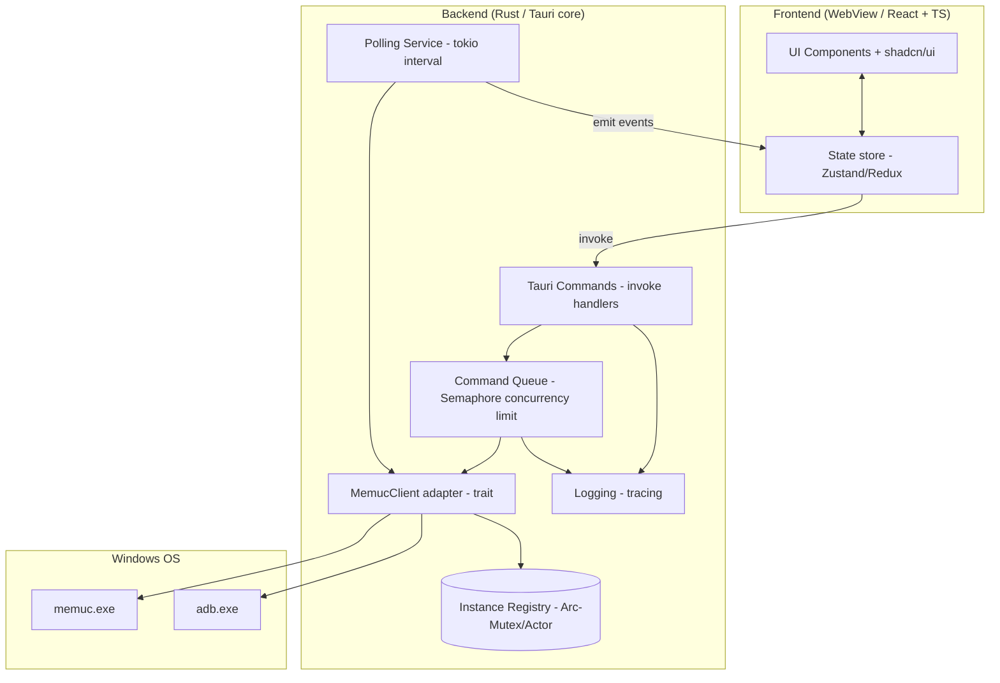

# TÀI LIỆU DỰ ÁN — ĐẶC TẢ YÊU CẦU & KẾ HOẠCH PHÁT TRIỂN (SRS & PROJECT PLAN)

**Tên dự án:** MEmu Play Manager (tên dự kiến — mã dự án: `MPM`)
**Mục tiêu:** Phát triển phần mềm desktop quản lý (fleet management) trình giả lập MEmu Play với giao diện hiện đại, hiệu năng cao và khả năng tự động hóa mở rộng.
**Phiên bản tài liệu:** 3.0 (Bản hợp nhất — gộp SRS v1.0 và bản nâng cấp v2.0, đã áp các quyết định đã chốt)
**Ngày cập nhật:** 2026-07-02
**Chuẩn tham chiếu:** ISO/IEC/IEEE 29148 (Requirements Engineering), C4 Model (Architecture), MoSCoW (Prioritization).

> **⚠️ CẬP NHẬT KIẾN TRÚC (2026-07-05) — ĐỌC TRƯỚC:** Tài liệu v3.0 mô tả mô hình
> *instance-centric* (1 tài khoản ↔ 1 VM bền, thao tác hàng loạt, warm pool, proxy).
> Bản cài **hiện tại** đã chuyển sang **mô hình PROFILE dùng-một-lần**: profile = dữ
> liệu bền (khóa theo username, credential mã hóa); VM được **tạo mới mỗi lần Chạy** rồi
> **HỦY khi Dừng** (backup phiên trước; tối đa 5 VM song song). Đã **GỠ HẲN**: warm pool,
> proxy, và toàn bộ API/lệnh instance-centric (start/stop/reboot/create/clone/rename/bulk
> /swap/launch). Nguồn chân lý mô hình hiện hành: **`docs/BACKUP_RESTORE_DESIGN.md`** +
> **`docs/E2E_RUNBOOK.md §8`**. Các mục § nói về proxy/pool/bulk/instance-lifecycle bên
> dưới là **LỊCH SỬ**, không còn hiệu lực.

> **Quyết định đã chốt (xem §18):** (1) Dùng MEmu bản **mới nhất**; (2) Vận hành **tối đa 5 máy ảo** cùng lúc — kiến trúc vẫn giữ chuẩn mở rộng nhưng yêu cầu hiệu năng được hiệu chỉnh về quy mô nhỏ; (3) Khởi tạo ngay với **Tauri + React + TailwindCSS**.

---

## MỤC LỤC
1. Tóm tắt điều hành (Executive Summary)
2. Thuật ngữ (Glossary)
3. Tổng quan dự án (bối cảnh, phạm vi, stakeholders, personas)
4. Giả định, Ràng buộc, Phụ thuộc
5. Yêu cầu chức năng (Functional Requirements)
6. Yêu cầu phi chức năng (Non-functional Requirements)
7. Đặc tả tích hợp Domain (`memuc` / `adb`)
8. Kiến trúc hệ thống (Architecture)
9. Thiết kế Bảo mật (Security Design)
10. Thiết kế Giao diện (UI/UX)
11. Xử lý lỗi, Logging & Observability
12. Chiến lược Kiểm thử & Đảm bảo chất lượng (QA)
13. Build, Đóng gói, CI/CD & Auto-update
14. Lộ trình phát triển (Roadmap & Milestones)
15. Quản lý rủi ro (Risk Register)
16. Định nghĩa Hoàn thành (Definition of Done)
17. Lộ trình tương lai (Future Work)
18. Kết luận & Thông tin chốt

---

## 1. TÓM TẮT ĐIỀU HÀNH (EXECUTIVE SUMMARY)

MPM là một ứng dụng desktop Windows cho phép người dùng vận hành, cấu hình và giám sát **tối đa ~5 máy ảo MEmu Play** (kiến trúc mở rộng được) từ một giao diện duy nhất. Ứng dụng thay thế công cụ Multi-MEmu mặc định bằng trải nghiệm hiện đại (Dark Mode, micro-animation), đồng thời đặt nền móng kiến trúc cho module tự động hóa (automation scripting) trong tương lai.

**Trụ cột giá trị:** (1) Vận hành hàng loạt an toàn & có kiểm soát tải; (2) Giao diện đẹp – phản hồi tức thời; (3) Nhẹ tài nguyên để nhường CPU/RAM cho các máy ảo; (4) Kiến trúc mở rộng được.

**Stack đã chốt:** Tauri (Rust) + React + TypeScript + TailwindCSS + shadcn/ui + Framer Motion. Lý do và phương án thay thế: xem §8.

---

## 2. THUẬT NGỮ (GLOSSARY)

| Thuật ngữ | Định nghĩa |
| :-- | :-- |
| **Instance / VM** | Một máy ảo MEmu Play, định danh bởi `index` (số nguyên) và `title` (tên). |
| **`memuc.exe`** | Công cụ dòng lệnh chính thức của MEmu để điều khiển máy ảo. |
| **`adb.exe`** | Android Debug Bridge — cầu nối gửi lệnh vào trong Android của máy ảo. |
| **Fleet** | Tập hợp toàn bộ instance được MPM quản lý. |
| **Bulk action** | Thao tác áp dụng đồng thời lên nhiều instance được chọn. |
| **Command queue** | Hàng đợi lệnh phía backend có giới hạn số lệnh chạy song song (concurrency limit). |
| **Polling** | Chu kỳ định kỳ gọi `memuc listvms` để đồng bộ trạng thái. |
| **IPC** | Giao tiếp giữa frontend (WebView) và backend (Rust) qua `invoke`/`emit` của Tauri. |
| **DPAPI** | Windows Data Protection API — mã hóa dữ liệu nhạy cảm theo tài khoản người dùng. |

---

## 3. TỔNG QUAN DỰ ÁN

### 3.1. Bối cảnh & Vấn đề
Người dùng vận hành nhiều tài khoản/thiết bị ảo (marketing, kiểm thử app, farming) phải thao tác thủ công với Multi-MEmu — giao diện hạn chế, không hỗ trợ cấu hình hàng loạt hiệu quả, không có giám sát tập trung. MPM giải quyết bằng lớp quản trị tập trung, hiện đại và an toàn.

### 3.2. Phạm vi (Scope)

**Trong phạm vi (In-scope) — v1.0:**
- Quản lý vòng đời VM: liệt kê, tạo, xóa, khởi động, dừng, reboot, clone, đổi tên.
- Cấu hình VM: CPU cores, RAM, độ phân giải/DPI, model/IMEI/brand, IP/proxy.
- Bulk actions với kiểm soát tải (throttling).
- Giám sát trạng thái thời gian thực (Running/Stopped, PID, window handle, IP).
- Tìm kiếm, lọc, sắp xếp; chuyển layout Grid/List; Dark/Light theme.
- Cài đặt đường dẫn MEmu, log viewer.

**Ngoài phạm vi (Out-of-scope) — v1.0 (đưa vào Future Work):**
- Trình soạn/chạy script tự động hóa đầy đủ (chỉ chuẩn bị kiến trúc plugin).
- Điều khiển đa máy tính qua mạng (remote agents).
- Hỗ trợ giả lập khác (LDPlayer, Nox...).
- macOS/Linux (MEmu là Windows-only).

### 3.3. Stakeholders & Personas

| Vai trò | Quan tâm chính |
| :-- | :-- |
| Power user / vận hành fleet nhỏ | Thao tác hàng loạt nhanh, ổn định với vài máy ảo. |
| Người dùng kỹ thuật thấp | UI trực quan, không cần nhớ lệnh CLI. |
| Nhà phát triển (nội bộ) | Kiến trúc rõ ràng, dễ mở rộng, dễ test. |

**Persona A — "Minh, vận hành tới 5 VM":** cần start/stop theo nhóm mà không làm treo máy, cần thấy VM nào chết để khởi động lại.
**Persona B — "Lan, tester":** tạo nhanh vài VM cấu hình giống nhau, đổi model/IMEI, cài app, dọn dẹp sau khi xong.

---

## 4. GIẢ ĐỊNH, RÀNG BUỘC, PHỤ THUỘC

**Giả định (Assumptions):**
- A1: MEmu Play (bản mới nhất) đã được cài đặt; `memuc.exe` và `adb.exe` tồn tại trong thư mục cài đặt.
- A2: Người dùng chạy MPM với quyền đủ để spawn process MEmu (thường là user thường; một số thao tác có thể cần Admin).
- A3: Máy host đủ tài nguyên cho số VM mục tiêu (MPM không tạo tài nguyên, chỉ điều phối).

**Ràng buộc (Constraints):**
- C1: Chỉ chạy trên Windows 10/11 x64.
- C2: Phụ thuộc format output & tập lệnh của `memuc` (có thể đổi giữa các phiên bản MEmu → xem R-07).
- C3: Không sửa file cấu hình VM trực tiếp trừ khi qua `memuc setconfigex` (tránh làm hỏng VM).

**Phụ thuộc (Dependencies):**
- D1: Bộ MEmu (`memuc.exe`, `adb.exe`).
- D2: WebView2 Runtime (Tauri yêu cầu; thường có sẵn trên Win11, cần bundle bootstrapper cho Win10).

---

## 5. YÊU CẦU CHỨC NĂNG (FUNCTIONAL REQUIREMENTS)

Ký hiệu độ ưu tiên (MoSCoW): **M** = Must, **S** = Should, **C** = Could, **W** = Won't (v1.0).
Mỗi yêu cầu có mã `FR-<epic>-<n>`, độ ưu tiên và **tiêu chí chấp nhận (AC)** để nghiệm thu & viết test.

### EPIC A — Khám phá & Giám sát
| Mã | Ưu tiên | Mô tả | Tiêu chí chấp nhận (AC) |
| :-- | :--: | :-- | :-- |
| FR-A-1 | M | Liệt kê toàn bộ VM với: index, title, status, PID, window handle, disk usage. | Khi có N VM, danh sách hiển thị đúng N dòng khớp `memuc listvms`; sai lệch ≤ 1 chu kỳ polling. |
| FR-A-2 | M | Cập nhật trạng thái theo chu kỳ polling (mặc định 3s, cấu hình được 1–10s). | Đổi trạng thái 1 VM ngoài app → UI phản ánh trong ≤ interval + 500ms. |
| FR-A-3 | M | Hiển thị địa chỉ IP nội bộ của VM đang chạy. | Với VM Running, IP hiển thị đúng theo `adb`/`getconfig`; VM Stopped hiển thị "—". |
| FR-A-4 | S | Chỉ báo tài nguyên tổng (số VM chạy, tổng RAM ước tính). | Số VM Running khớp thực tế; cập nhật cùng chu kỳ polling. |

### EPIC B — Vòng đời VM
| Mã | Ưu tiên | Mô tả | AC |
| :-- | :--: | :-- | :-- |
| FR-B-1 | M | Start / Stop / Reboot một VM. | Lệnh phát đúng index; UI chuyển sang trạng thái "đang xử lý" tới khi polling xác nhận. |
| FR-B-2 | M | Tạo VM mới (chọn Android/cấu hình cơ bản). | VM mới xuất hiện trong danh sách sau khi lệnh thành công. |
| FR-B-3 | M | Xóa VM (có xác nhận 2 bước, cảnh báo không hoàn tác). | Xóa chỉ khi người dùng xác nhận; VM biến mất khỏi danh sách. |
| FR-B-4 | S | Clone VM (nhân bản cấu hình). | VM clone xuất hiện; không ảnh hưởng VM nguồn. |
| FR-B-5 | S | Đổi tên VM. | Title mới hiển thị sau khi thành công; từ chối tên rỗng/ký tự không hợp lệ. |

### EPIC C — Thao tác hàng loạt (Bulk)
| Mã | Ưu tiên | Mô tả | AC |
| :-- | :--: | :-- | :-- |
| FR-C-1 | M | Chọn nhiều VM (checkbox, select-all, shift-select). | Số lượng đã chọn hiển thị; hành động áp đúng tập đã chọn. |
| FR-C-2 | M | Start/Stop/Reboot hàng loạt **có kiểm soát tải** (giới hạn K lệnh song song, cấu hình được). | Không phát quá K lệnh start đồng thời; có tiến độ (x/N hoàn tất). |
| FR-C-3 | S | Áp cấu hình hàng loạt (CPU/RAM/độ phân giải). | Áp đúng cho mọi VM đã chọn; báo cáo VM lỗi riêng lẻ mà không dừng cả lô. |

### EPIC D — Cấu hình VM
| Mã | Ưu tiên | Mô tả | AC |
| :-- | :--: | :-- | :-- |
| FR-D-1 | M | Chỉnh CPU cores & RAM. | Giá trị lưu qua `setconfigex`; đọc lại đúng qua `getconfigex`. |
| FR-D-2 | S | Chỉnh độ phân giải / DPI. | Áp dụng và verify được. |
| FR-D-3 | S | Chỉnh model/brand/IMEI/thông tin thiết bị. | Giá trị được set và đọc lại đúng; sinh IMEI hợp lệ (Luhn) nếu random. |
| FR-D-4 | S | Cấu hình IP/proxy cho VM. | Proxy được lưu (credential mã hóa — §9); VM ra internet qua proxy. |

### EPIC E — Trải nghiệm & Cài đặt
| Mã | Ưu tiên | Mô tả | AC |
| :-- | :--: | :-- | :-- |
| FR-E-1 | M | Tìm kiếm/lọc theo tên & trạng thái. | Kết quả lọc chính xác, cập nhật realtime khi gõ. |
| FR-E-2 | S | Chuyển layout Grid ↔ List; đổi Dark/Light theme (nhớ lựa chọn). | Lựa chọn được lưu và khôi phục sau khi khởi động lại. |
| FR-E-3 | M | Cấu hình đường dẫn cài đặt MEmu (tự dò Registry, cho phép sửa tay). | Nếu không tìm thấy tự động, người dùng trỏ tay và app hoạt động. |
| FR-E-4 | S | Trình xem log trong app. | Hiển thị log gần nhất, lọc theo mức (info/warn/error). |
| FR-E-5 | C | (Chuẩn bị) Điểm cắm module Automation Scripts. | Có interface/registry để nạp plugin ở bản sau (không cần chạy script ở v1.0). |

---

## 6. YÊU CẦU PHI CHỨC NĂNG (NON-FUNCTIONAL REQUIREMENTS) — ĐỊNH LƯỢNG

| Mã | Nhóm | Mục tiêu đo được |
| :-- | :-- | :-- |
| NFR-P1 | Hiệu năng | RAM idle của MPM < **150 MB**; CPU idle < **2%** (không tính các VM). |
| NFR-P2 | Hiệu năng | Thời gian khởi động app < **2s** trên máy mục tiêu (SSD, 8GB+ RAM). |
| NFR-P3 | Hiệu năng | Độ trễ tương tác UI < **100ms**; danh sách luôn mượt (~60fps). Kỹ thuật virtualization được giữ sẵn cho khả năng mở rộng dù mục tiêu hiện tại chỉ 5 VM. |
| NFR-P4 | Khả mở rộng | Quản lý mượt tối đa **5 instances** (theo yêu cầu); kiến trúc không giới hạn cứng để mở rộng sau. |
| NFR-R1 | Độ tin cậy | Một VM crash/`memuc` timeout **không** làm treo hay crash MPM (cô lập lỗi). |
| NFR-R2 | Độ tin cậy | Mọi lệnh có **timeout** (mặc định 15s, cấu hình được) và cơ chế báo lỗi trực quan. |
| NFR-U1 | Khả dụng | Mọi thao tác chính đạt được trong ≤ 3 cú click từ màn hình chính. |
| NFR-U2 | Khả dụng (a11y) | Tương phản màu đạt WCAG AA; điều hướng bàn phím cho hành động chính. |
| NFR-S1 | Bảo mật | Không có command injection (dùng argv, không ghép shell string) — §9. |
| NFR-S2 | Bảo mật | Credential proxy được mã hóa lúc lưu (DPAPI / secret store). |
| NFR-M1 | Bảo trì | Lớp tích hợp `memuc` được trừu tượng hóa sau 1 trait/interface, có bộ test parser ≥ **80%** coverage. |
| NFR-C1 | Tương thích | Chạy trên Windows 10 (build ≥ 1809) & Windows 11 x64. |
| NFR-O1 | Vận hành | Log có xoay vòng (rotation), giới hạn dung lượng, không rò rỉ thông tin nhạy cảm. |

---

## 7. ĐẶC TẢ TÍCH HỢP DOMAIN (`memuc` / `adb`)

> Đây là phần **quan trọng nhất về mặt kỹ thuật**. Toàn bộ tương tác OS phải đi qua một lớp adapter duy nhất (`MemucClient`) để dễ test và dễ thích ứng khi MEmu đổi format.

### 7.1. Ma trận lệnh (tham chiếu — cần xác minh theo bản MEmu mới nhất trong Giai đoạn 0)
| Chức năng | Lệnh (dạng đối số, KHÔNG ghép shell) |
| :-- | :-- |
| Liệt kê VM | `memuc listvms` (parse dòng CSV: `index,title,top-handle,status,pid,disk`) |
| Khởi động | `memuc start -i <index>` |
| Dừng | `memuc stop -i <index>` ; dừng tất cả `memuc stopall` |
| Reboot | `memuc reboot -i <index>` |
| Tạo | `memuc create [<android_version>]` |
| Xóa | `memuc remove -i <index>` |
| Clone | `memuc clone -i <index>` |
| Đổi tên | `memuc rename -i <index> "<name>"` |
| Sắp cửa sổ | `memuc sort` |
| Set cấu hình | `memuc setconfigex -i <index> <key> <value>` (vd key: `cpus`, `memory`, `resolution`, `custom` v.v.) |
| Đọc cấu hình | `memuc getconfigex -i <index> <key>` |
| Gửi lệnh ADB | `memuc adb -i <index> <adb args>` (vd lấy IP, cài apk) |

**Nguyên tắc bắt buộc:**
- Mọi tham số người dùng (title, path, proxy) truyền qua **mảng đối số** của `Command`, tuyệt đối không nối chuỗi vào shell (chống injection — §9).
- Xác minh chính xác cú pháp/tập lệnh & format output với **phiên bản MEmu mới nhất** ngay Giai đoạn 0; ghi lại "bản hợp đồng" (fixtures) làm dữ liệu test.

### 7.2. Hành vi bất đồng bộ & mô hình trạng thái
- Nhiều lệnh `memuc` trả về **ngay lập tức** trong khi thao tác thực tế (boot VM) diễn ra nền → **không** coi lệnh thành công là trạng thái cuối.
- **Nguồn sự thật (source of truth)** cho trạng thái là **polling `listvms`**, không phải kết quả lệnh riêng lẻ.
- Vòng đời UI của một hành động: `Idle → Pending (đã phát lệnh) → Confirmed/Failed (theo polling hoặc timeout)`.

### 7.3. Parser output
- Viết parser thuần (pure function) nhận `stdout` → `Vec<Instance>`; test bằng fixtures (nhiều VM, 0 VM, dòng lỗi, ký tự đặc biệt trong title).
- Chịu lỗi (fault-tolerant): dòng không parse được → log warn, bỏ qua dòng đó thay vì crash.

---

## 8. KIẾN TRÚC HỆ THỐNG (ARCHITECTURE)

### 8.1. Lựa chọn công nghệ (đã chốt)
- **Chọn: Tauri (Rust) + React + TypeScript + Tailwind + shadcn/ui + Framer Motion.**
  - Tauri: binary nhỏ, RAM thấp (đáp ứng NFR-P1), spawn process native nhanh, cơ chế IPC & capabilities bảo mật tốt, có auto-updater ký số.
  - Rust + `tokio`: xử lý async, hàng đợi lệnh có kiểm soát tải một cách an toàn về bộ nhớ/luồng.
- **Thay thế 1 — Electron + React:** UI tương đương nhưng RAM cao hơn (vi phạm NFR-P1 khó hơn), bảo mật IPC cần cẩn trọng hơn.
- **Thay thế 2 — C# WPF + WinUI3:** mạnh trên Windows, nhưng tốc độ dựng UI hiện đại chậm hơn hệ sinh thái React/Tailwind.

### 8.2. Mô hình phân lớp (C4 — Container/Component)



### 8.3. Mô hình concurrency (điểm cốt lõi)
- **Command Queue** với `tokio::sync::Semaphore(K)` giới hạn số lệnh nặng chạy song song (mặc định K=3, cấu hình được) → chống làm treo host khi bulk-start (giải quyết R-01, đáp ứng FR-C-2).
- **Polling Service** chạy trên interval riêng, không bị chặn bởi hàng đợi lệnh; dùng timeout cho mỗi lần gọi.
- **Instance Registry** là state dùng chung (Arc<Mutex<...>> hoặc mô hình actor với message-passing) — mọi cập nhật đi qua đây rồi `emit` diff lên frontend.

### 8.4. Giao tiếp IPC (Tauri)
- **Commands (`invoke`)** cho hành động khởi phát từ UI: `list_instances`, `start_instance`, `bulk_action`, `set_config`, `get_settings`...
- **Events (`emit`)** cho luồng đẩy: `instances:update`, `action:progress`, `error:occurred`.
- Payload định nghĩa bằng TypeScript types sinh từ Rust (vd `ts-rs`) để đồng bộ kiểu FE↔BE.

### 8.5. Data model (rút gọn)
```
Instance { index:u32, title:String, status:Status, pid:Option<u32>,
           window_handle:Option<isize>, ip:Option<String>, disk_usage:Option<u64> }
Status = Stopped | Starting | Running | Stopping | Error
AppSettings { memu_path:PathBuf, poll_interval_ms:u32, max_concurrency:u8, theme:Theme, layout:Layout }
```

### 8.6. State phía frontend
- Store nhẹ (Zustand) giữ danh sách instance + trạng thái UI; nhận diff từ event `instances:update`.
- Danh sách render bằng **virtualization** (`@tanstack/react-virtual`) — giữ sẵn cho khả năng mở rộng dù quy mô hiện tại nhỏ (đáp ứng NFR-P3/P4).

---

## 9. THIẾT KẾ BẢO MẬT (SECURITY DESIGN)

| Mã | Rủi ro | Biện pháp |
| :-- | :-- | :-- |
| SEC-1 | **Command injection** qua title/path/proxy | Luôn truyền **mảng đối số** cho `Command`; không dùng `cmd /c` nối chuỗi; validate & escape đầu vào; whitelist ký tự cho title. |
| SEC-2 | Path traversal / chạy nhầm binary | Chỉ chạy `memuc.exe`/`adb.exe` từ đường dẫn đã xác thực (dò Registry hoặc người dùng đặt); kiểm tra file tồn tại & (khuyến nghị) chữ ký. |
| SEC-3 | Lộ credential proxy | Mã hóa khi lưu bằng **DPAPI** (hoặc keyring); không log credential; che (mask) trên UI. |
| SEC-4 | Bề mặt tấn công WebView | Bật **Tauri capabilities/allowlist** tối thiểu; tắt các API không dùng; CSP nghiêm ngặt; không load nội dung web ngoài. |
| SEC-5 | Giả mạo bản cập nhật | Auto-update dùng **manifest ký số** (Tauri updater) + code signing binary. |
| SEC-6 | Rò rỉ qua log | Log không chứa credential/token; xoay vòng & giới hạn dung lượng (NFR-O1). |

---

## 10. THIẾT KẾ GIAO DIỆN (UI/UX)

### 10.1. Bố cục (Layout)
- **Sidebar trái:** Dashboard, Instances, Automation (đặt chỗ), Logs, Settings.
- **Header:** search, quick actions (Start/Stop All có xác nhận), bộ đếm tài nguyên, toggle Grid/List, toggle theme, thông báo.
- **Main:** danh sách Card/Table bo góc, soft shadow, badge trạng thái (Xanh=Running, Xám=Stopped, Vàng=Đang xử lý, Đỏ=Error).

### 10.2. Design system
- **Design tokens:** màu, spacing, radius, shadow, typography định nghĩa tập trung (Tailwind config) — bật/tắt Dark/Light qua CSS variables.
- **Màu nhấn:** gradient cao cấp (Tím–Xanh dương). Bảo đảm tương phản **WCAG AA** (NFR-U2). Phong cách Glassmorphism/Fluent, ưu tiên yếu tố thẩm mỹ (WOW factor).
- **Typography:** Inter / Roboto / Outfit (Google Fonts).
- **Animation:** Framer Motion cho hover/transition; **tôn trọng `prefers-reduced-motion`**.

### 10.3. Trạng thái giao diện bắt buộc (thường bị bỏ sót)
Với mỗi màn hình danh sách/hành động phải thiết kế đủ: **Loading**, **Empty** (chưa có VM / chưa trỏ path MEmu), **Error** (memuc không phản hồi), **Partial failure** (bulk: x thành công / y lỗi), **Confirm nguy hiểm** (xóa VM). Mọi lỗi hiển thị thông điệp rõ ràng + hành động khắc phục.

---

## 11. XỬ LÝ LỖI, LOGGING & OBSERVABILITY

- **Chiến lược lỗi:** phân loại lỗi (memuc-not-found, timeout, parse-error, VM-error); mỗi loại có thông điệp người dùng + gợi ý xử lý; lỗi một VM không lan sang cả lô/ứng dụng (NFR-R1).
- **Timeout:** mọi lời gọi process có deadline (NFR-R2); hết giờ → hủy child process, đánh dấu Error, log.
- **Logging:** dùng `tracing` (structured, có level); ghi ra file **xoay vòng** trong thư mục AppData; **không log dữ liệu nhạy cảm** (SEC-6).
- **In-app log viewer** (FR-E-4) đọc file log, lọc theo level.
- **Telemetry:** không thu thập dữ liệu người dùng ở v1.0 (privacy-first); nếu thêm sau phải opt-in.

---

## 12. CHIẾN LƯỢC KIỂM THỬ & QA

| Tầng | Phạm vi | Công cụ |
| :-- | :-- | :-- |
| Unit (Rust) | Parser `listvms`, command builder, IMEI/Luhn, logic queue/semaphore | `cargo test` + fixtures |
| Unit (FE) | Component & store logic | Vitest + React Testing Library |
| Integration | `MemucClient` trait với **mock adapter** (không cần MEmu thật) | Rust test double |
| E2E | Luồng chính qua UI thật | Playwright + `tauri-driver` (WebDriver) |
| Thủ công / thực địa | Chạy tối đa **5 VM** thực tế: ổn định, RAM, hành vi bulk có throttle | Kịch bản QA có checklist |
| Non-functional | Đo RAM/CPU idle, latency UI, fps, thời gian khởi động | Đối chiếu NFR §6 |

- **Test double bắt buộc:** trừu tượng hóa lớp OS sau trait `MemucClient` để test không phụ thuộc MEmu (đáp ứng NFR-M1).
- **Định nghĩa "pass":** đạt toàn bộ AC của FR + ngưỡng NFR định lượng.
- **Regression:** mọi bug fix kèm test tái hiện.

---

## 13. BUILD, ĐÓNG GÓI, CI/CD & AUTO-UPDATE

- **CI (GitHub Actions):** lint (clippy, eslint), test (cargo + vitest), build cross-check trên Windows runner.
- **CD:** `tauri-action` build ra **`.msi` / NSIS `.exe`**; **code signing** binary; sinh manifest cập nhật **ký số**.
- **Auto-update:** Tauri updater kiểm tra & cài bản mới an toàn (SEC-5).
- **Đóng gói WebView2:** bundle bootstrapper cho Windows 10 (D2/NFR-C1).
- **Versioning:** SemVer; changelog cho mỗi release.
- **Xử lý antivirus false-positive:** ký số + (nếu cần) khai báo với nhà cung cấp AV (xem R-08).

---

## 14. LỘ TRÌNH PHÁT TRIỂN (ROADMAP & MILESTONES)

> Dự án triển khai theo Agile/Scrum. Thời lượng là ước lượng cho 1 dev full-time; nên hiệu chỉnh theo nguồn lực thực tế. Mỗi giai đoạn có **exit criteria** rõ ràng.

### Giai đoạn 0 — Nền tảng & PoC domain (≈ Tuần 1)
- Xác minh **tập lệnh & format output `memuc`** trên phiên bản MEmu mới nhất; tạo fixtures.
- Khởi tạo repo Tauri + React + TS + Tailwind, thiết lập CI (lint/test), logging khung.
- PoC: `list_instances` + start/stop 1 VM chạy thật end-to-end.
- Thiết kế UI Mockup & thống nhất Design System (component, colors, fonts).
- **Exit:** gọi được memuc từ Rust; parser có test; CI xanh; design system nháp.

### Giai đoạn 1 — Core backend & vòng đời VM (≈ Tuần 2)
- `MemucClient` trait + mock; Command Queue (semaphore); Polling Service; Instance Registry; IPC events.
- FR-B-1..5 (start/stop/reboot/create/remove/clone/rename); FR-A-1..3.
- **Exit:** đạt AC các FR trên; lỗi 1 VM không sập app; unit test parser/queue đạt ngưỡng.

### Giai đoạn 2 — Giao diện & trải nghiệm (≈ Tuần 3)
- Dựng UI hoàn chỉnh từ design system; virtualization danh sách; Grid/List; Dark/Light; search/filter (FR-E-1..3).
- Bulk selection + bulk actions có throttle (FR-C-1..2); hiệu ứng hover/transition; trạng thái Loading/Empty/Error/Partial (§10.3).
- **Exit:** đạt AC FR-C, FR-E; đạt NFR-P3 (UI mượt).

### Giai đoạn 3 — Cấu hình, Bảo mật, Kiểm thử, Đóng gói (≈ Tuần 4–5)
- FR-D (CPU/RAM/độ phân giải/model-IMEI/proxy) + mã hóa credential (SEC-3).
- Rà soát bảo mật §9; log viewer (FR-E-4); E2E Playwright; QA thực địa tối đa 5 VM (kiểm tra ổn định & RAM).
- CI/CD đóng gói `.msi/.exe`, code signing, auto-update; viết tài liệu người dùng.
- **Exit (Release 1.0):** đạt toàn bộ DoD §16.

---

## 15. QUẢN LÝ RỦI RO (RISK REGISTER)

Thang: Khả năng (L/M/H) × Ảnh hưởng (L/M/H).

| Mã | Rủi ro | K.năng | A.hưởng | Biện pháp / Trigger |
| :-- | :-- | :--: | :--: | :-- |
| R-01 | `memuc` chậm/treo khi bulk nhiều VM | M | H | Async + **Command Queue giới hạn K song song**; timeout mỗi lệnh; báo lỗi trực quan. |
| R-02 | UI lag khi render danh sách | L | L | Virtualization sẵn có; gửi **diff** thay vì toàn bộ; đo fps (NFR-P3). |
| R-03 | Đường dẫn MEmu không đồng nhất / không tìm thấy | M | M | Dò Registry + cho người dùng trỏ tay (FR-E-3); trạng thái Empty hướng dẫn. |
| R-04 | **Command injection** qua input người dùng | M | H | argv thay vì shell string; validate/whitelist (SEC-1). |
| R-05 | Race condition giữa polling và hành động người dùng | M | M | State qua registry đồng bộ; trạng thái Pending; nguồn sự thật là polling (§7.2). |
| R-06 | Xung đột cổng ADB / IP giữa nhiều VM | M | M | Lấy IP qua `memuc adb`/getconfig; xử lý lỗi từng VM độc lập. |
| R-07 | **MEmu đổi tập lệnh/format output giữa các bản** | M | H | Cô lập sau `MemucClient`; fixtures theo phiên bản; kiểm tra tương thích ở Giai đoạn 0; cảnh báo khi parse thất bại. |
| R-08 | Antivirus báo false-positive (app spawn nhiều process) | M | M | Code signing; giảm hành vi giống malware; hướng dẫn allowlist; liên hệ nhà cung cấp AV nếu cần. |
| R-09 | Thiếu WebView2 trên Windows 10 | L | M | Bundle bootstrapper; kiểm tra runtime lúc cài đặt (D2). |
| R-10 | Timeline không đủ cho full scope | M | M | Ưu tiên theo MoSCoW; cắt Should/Could nếu trễ; MVP = Must trước. |
| R-11 | Thao tác phá hủy (xóa nhầm VM hàng loạt) | M | H | Xác nhận 2 bước; cảnh báo không hoàn tác; log hành động (FR-B-3). |

---

## 16. ĐỊNH NGHĨA HOÀN THÀNH (DEFINITION OF DONE)

Một hạng mục/Release chỉ "Done" khi:
- [ ] Đạt **toàn bộ tiêu chí chấp nhận (AC)** của các FR liên quan.
- [ ] Đạt **ngưỡng NFR định lượng** liên quan (RAM/CPU/latency/fps/số VM).
- [ ] Có test tự động phủ (unit + integration; E2E cho luồng chính) và **CI xanh**.
- [ ] Rà soát bảo mật §9 cho phần liên quan (đặc biệt SEC-1/SEC-3).
- [ ] Xử lý đủ trạng thái UI: Loading/Empty/Error/Partial/Confirm (§10.3).
- [ ] Log đúng chuẩn, không rò rỉ thông tin nhạy cảm.
- [ ] Tài liệu người dùng & changelog cập nhật; build đóng gói ký số cài đặt được.

---

## 17. LỘ TRÌNH TƯƠNG LAI (FUTURE WORK)
- Module **Automation Scripting** đầy đủ (soạn/chạy kịch bản, scheduler) trên nền interface plugin đã chuẩn bị (FR-E-5).
- Template cấu hình VM & clone hàng loạt theo profile.
- Mở rộng quy mô vượt 5 VM (kiến trúc đã sẵn sàng).
- Điều khiển đa máy tính qua remote agents.
- Hỗ trợ giả lập khác (trừu tượng hóa adapter cho phép mở rộng).
- Dashboard thống kê tài nguyên nâng cao.

---

## 18. KẾT LUẬN & THÔNG TIN CHỐT

1. **Phiên bản MEmu:** dùng bản **mới nhất (Latest)**; tích hợp tập lệnh `memuc` tương ứng, xác minh cú pháp & format output ngay Giai đoạn 0.
2. **Quy mô:** vận hành tối đa **5 máy ảo** cùng lúc. Yêu cầu hiệu năng (virtualization, throttle) được hiệu chỉnh cho quy mô nhỏ nhưng **giữ nguyên cấu trúc chuẩn** để mở rộng sau.
3. **Công nghệ & khởi tạo:** khởi tạo ngay với **Tauri + React + TailwindCSS**.

*(Các câu hỏi khác — proxy HTTP/SOCKS5 có auth, i18n, chứng chỉ code signing — sẽ được quyết định trong quá trình phát triển tùy nhu cầu.)*
